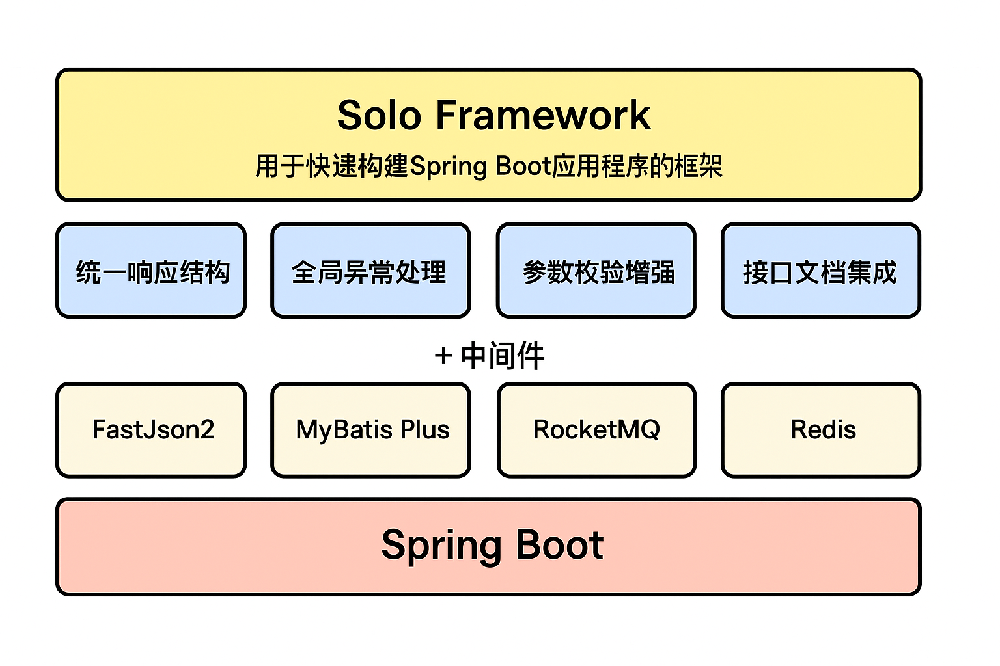

# Solo Framework

> 🚀 **专为云原生时代设计的 Spring Boot 轻量级开发框架**  
> 非侵入式 · Starter 接入 · 按需引入 · 开箱即用

---

## 📖 框架简介

Solo Framework 是一款轻量、非侵入式的 Spring Boot 开发框架，旨在简化 Web 应用开发，让开发者专注业务逻辑。

**核心设计理念**：
- ✅ **标准 Starter 接入**：引入一个依赖，极少配置即可开发
- ✅ **非侵入式**：不强制绑定项目结构，灵活可控
- ✅ **按需引入**：模块化设计，只引入需要的功能
- ✅ **开箱即用**：预置最佳实践，无需重复配置

---

## 💡 设计理念

### 为什么需要 Solo Framework？

在云原生架构下，Kubernetes 等基础设施已接管了 Spring Cloud 的服务治理与运维职责。开发者只需基于 Spring Boot 即可快速构建应用，但仍存在以下痛点：

| 痛点场景 | 传统方式 | Solo Framework |
|---------|---------|---------------|
| **API 文档集成** | 手动集成 Swagger/Knife4j，需处理兼容性 | 开箱即用，自动集成双 UI |
| **统一响应规范** | 从零搭建异常处理、返回结构、错误码体系 | 预置统一 ApiResponse + 全局异常处理 |
| **参数校验增强** | 需手写分组校验、集合校验、枚举校验逻辑 | 内置增强校验（分组/集合/枚举）|
| **JSON 返回规范** | 日期格式、空值处理缺乏统一标准 | 统一序列化策略，可灵活配置 |
| **MyBatis Plus 配置** | 配置项繁多，需手动整合 | 一键引入，自动配置 |
| **TraceId 链路追踪** | 需手写 Filter + 拦截器传播逻辑 | 全局自动注入与透传 |
| **国际化支持** | 需配置 MessageSource + Resolver | 统一配置，一键开启 |

### 与传统快速开发平台的差异

市面上快速开发平台通常提供：
- ✔ CRUD 权限管理、代码生成器、流程引擎、定时任务等

**但存在的问题**：
- ❌ **强侵入性**：需下载完整项目并在其架构上开发
- ❌ **灵活性差**：绑定特定技术栈与项目结构
- ❌ **维护成本高**：升级困难，难以剥离业务逻辑

**Solo Framework 的差异化优势**：

| 对比维度 | 传统快速开发平台 | Solo Framework |
|---------|---------------|---------------|
| 接入方式 | 下载项目模板，基于模板开发 | 标准 Starter 依赖引入 |
| 侵入性 | 强绑定项目结构与技术栈 | 非侵入，不限制项目结构 |
| 灵活性 | 难以剥离框架逻辑 | 模块化，按需引入 |
| 学习成本 | 需理解平台完整架构 | 符合 Spring Boot 规范 |
| 升级维护 | 依赖平台版本同步 | 独立版本，按需升级 |

---

## 🏗️ 架构设计



### 核心模块

| 模块 | 职责 | 必选/可选 |
|------|------|----------|
| **solo-framework-starter-common** | 通用工具类（Hutool 等）与基础定义 | ✅ 必选（被其他模块依赖）|
| **solo-framework-starter-core** | 配置体系、上下文、TraceId、运行时信息 | ✅ 必选（核心基础）|
| **solo-framework-starter-web** | Web 开发全家桶（Swagger/Knife4j、FastJSON2、统一响应、全局异常、参数校验、TraceId、国际化、远程调用） | ⭐ 推荐（Web 应用首选）|
| **solo-framework-starter-mts** | MyBatis Plus 自动配置 | ⚙️ 可选（需要 ORM 时引入）|

详细模块说明请参考：[📦 模块说明](docs/modules.md)

---

## 🚀 应用案例

基于 **Solo Framework + DeepSeek**，仅需 **一天** 即可完成小程序后端接口开发：

<p align="center">
  <a href="tapBill.png">
    
  </a>
</p>

**扫码体验**（小程序二维码）👇

---

## 📚 快速开始

### 1️⃣ 引入依赖

```xml
<dependency>
    <groupId>com.solo.framework</groupId>
    <artifactId>solo-framework-starter-web</artifactId>
    <version>${solo-framework.version}</version>
</dependency>
```

### 2️⃣ 启动项目

启动后控制台输出以下日志，即可直接开始业务开发：

```
Solo Framework Start Success! applicationName: null(建议配置), serverPort: 8080, contextPath: /
Swagger UI 接口文档地址: [http://localhost:8080/swagger-ui/index.html]
Knife4j UI 接口文档地址: [http://localhost:8080/doc.html]
```

### 3️⃣ 编写第一个接口

```java
@RestController
public class HelloController {

    @GetMapping("/hello")
    public String hello(@RequestParam String name) {
        return "Hello, " + name;
    }
}
```

**访问接口**：`http://localhost:8080/hello?name=Solo`

**返回结果**（框架自动包装为统一 ApiResponse）：
```json
{
  "code": 0,
  "message": "请求成功",
  "data": "Hello, Solo",
  "traceId": "abc-123-def",
  "timestamp": 1735200000000
}
```

🎯 **更多快速开始示例**，请参考：[⚡ 快速开始指南](docs/quick-start.md)

---

## 🛠️ 核心功能

| 功能模块 | 说明 | 默认状态 |
|---------|------|---------|
| **接口文档（Swagger/Knife4j）** | 自动生成双 UI 文档，支持自定义配置 | ✅ 默认开启 |
| **统一响应包装** | 自动包装为 `ApiResponse`，支持自定义扩展 | ✅ 默认开启 |
| **全局异常处理** | 统一捕获并返回标准错误响应 | ✅ 默认开启 |
| **参数校验增强** | 分组校验、集合校验、枚举校验 | ✅ 默认开启 |
| **JSON 序列化（FastJSON2）** | 统一日期格式、空值处理 | ✅ 默认开启 |
| **TraceId 链路追踪** | 全局注入 + 远程调用透传 | ✅ 默认开启 |
| **国际化支持** | 多语言切换（中文/英文） | ⚙️ 需配置开启 |
| **请求日志打印** | 入站/出站请求自动日志记录 | ✅ 默认开启 |
| **远程调用（RestTemplate）** | OkHttp/HttpClient 统一配置 | ✅ 默认开启 |

📖 **详细功能说明与配置示例**，请参考：[🔧 功能详解](docs/features.md)

---

## 📄 文档导航

- [⚡ 快速开始](docs/quick-start.md) - 5分钟上手指南
- [🔧 功能详解](docs/features.md) - 详细配置与使用示例
- [📦 模块说明](docs/modules.md) - 模块依赖关系与按需引入指南

---

## 🔖 版本信息

- **当前版本**：`1.0.0`
- **Spring Boot 版本**：`2.5.7`
- **Java 版本**：`8+`

---

## 📜 开源协议

本项目基于 [Apache License 2.0](LICENSE) 开源协议。

---

## 👥 贡献指南

欢迎提交 Issue 和 Pull Request，共同完善 Solo Framework！

---

**Made with ❤️ by Solo Team**
